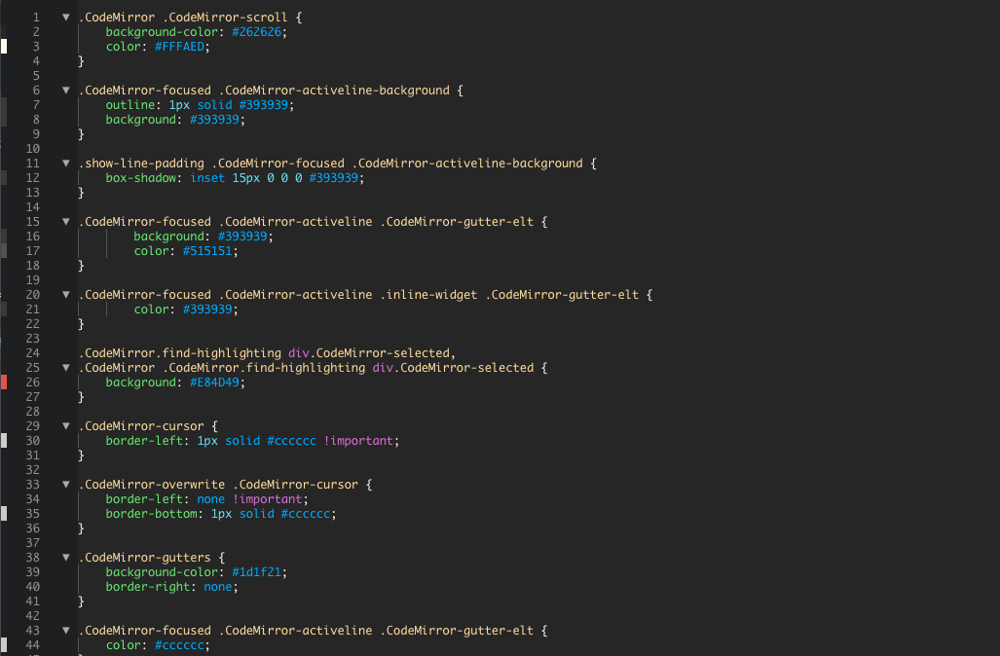
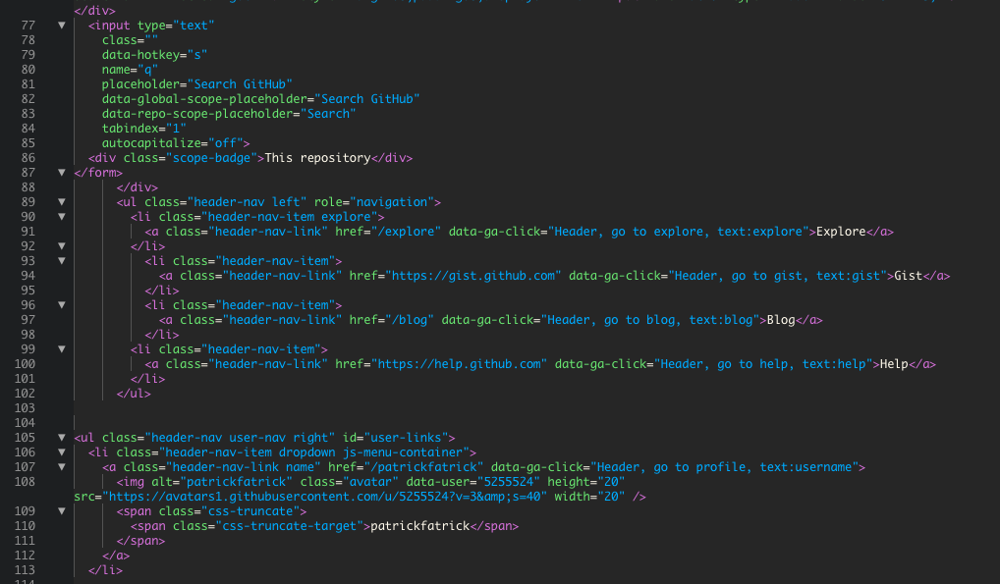
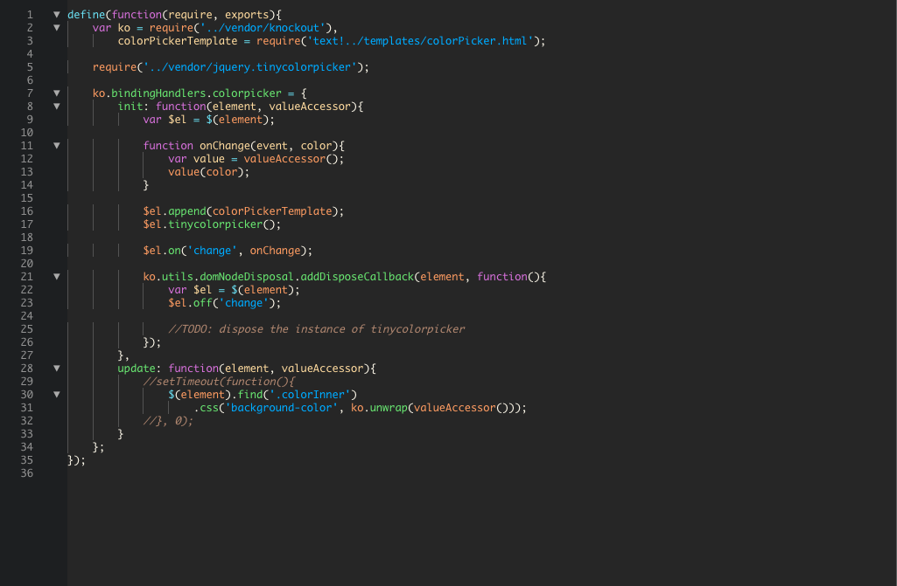

 The Orchid theme for Brackets
=========

A Brackets original. This theme is intended to be pleasant but still easy to read.

The CSS is modified from Ryan Stewart's [Tomorrow Night theme for Brackets](https://github.com/Brackets-Themes/TomorrowNight).

Also incorporates [Code Folding](https://github.com/thehogfather/brackets-code-folding) and [CSS Color Preview](https://github.com/cmgddd/Brackets-css-color-preview) styling taken from Dustin Dowell's [Neon theme](https://github.com/dustindowell22/neon-brackets-theme). Set the active tab color default in [Documents Toolbar](https://github.com/dnbard/brackets-documents-toolbar) to match the background color of the theme.

The font used in the screenshots is Monaco, in case you're curious.

For more themes and install instructions see the [Brackets Themes website](http://brackets-themes.github.io/)

## Theme Colors

`#FF9A69` `#B28773` `#262626` `#FFDAA5` `#E84D49` `#DA70D6` `#63E87F` `#FFFAED` `#00B0FF` `#00FFFF`

## CSS 

## HTML

## JavaScript
